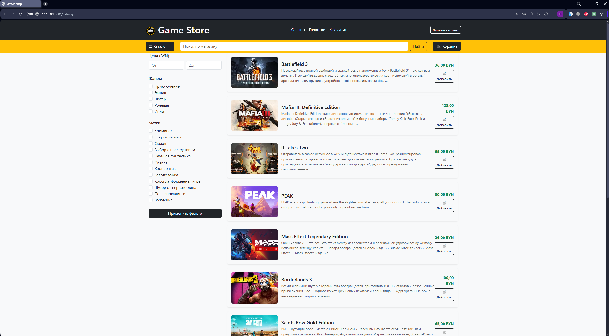
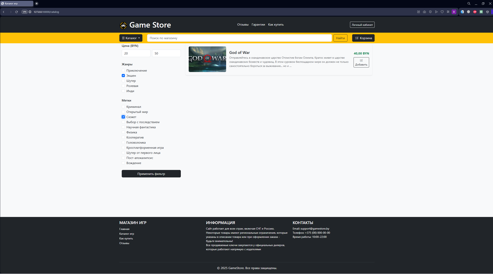
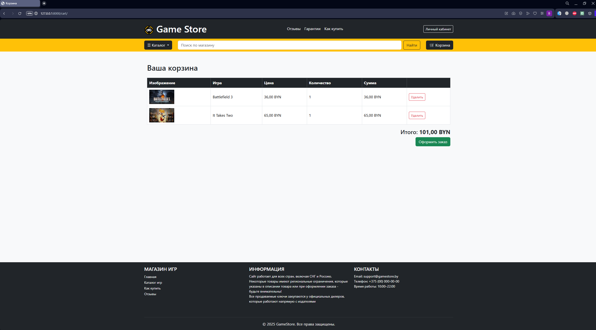
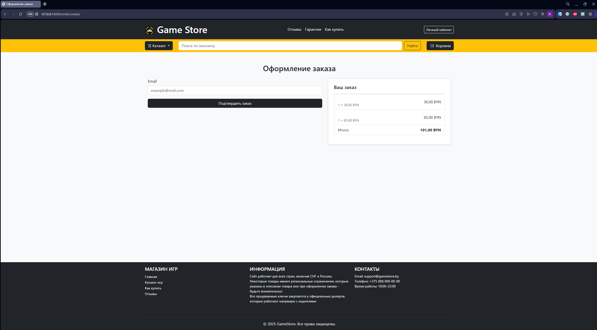
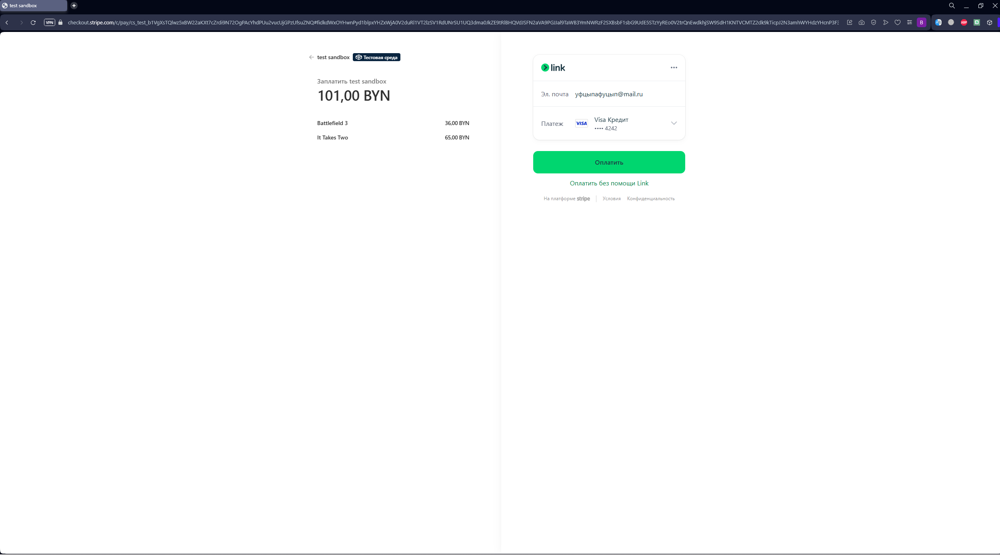
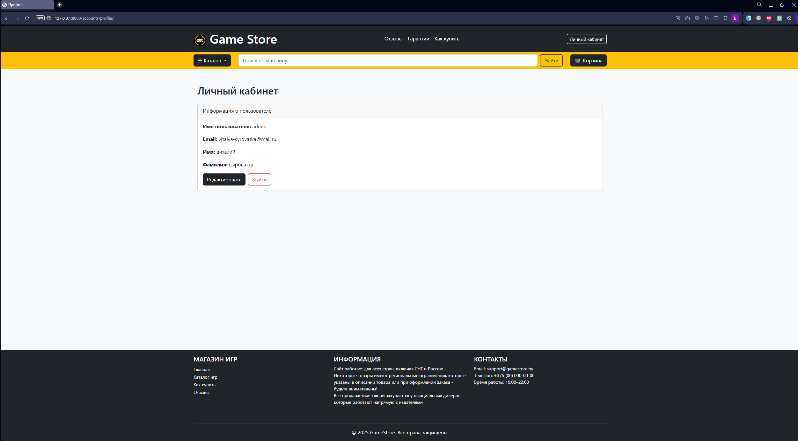
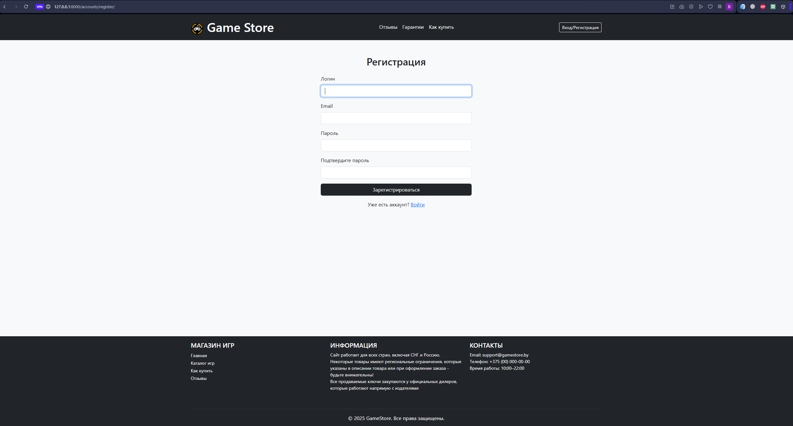
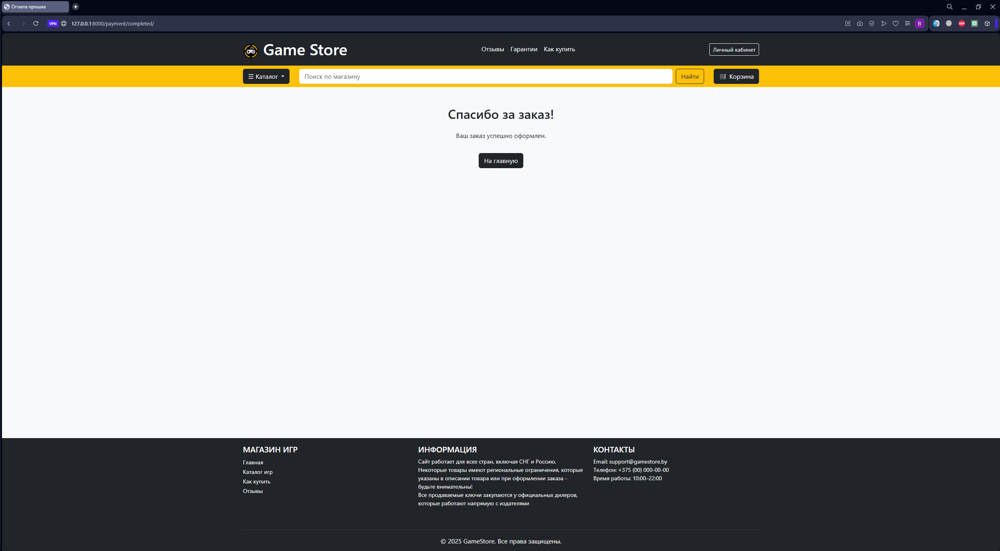
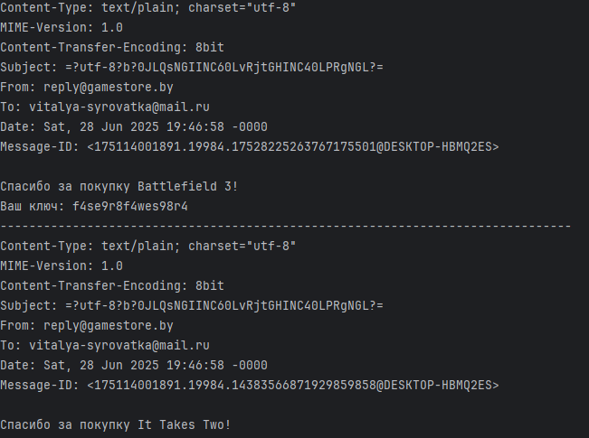

# 🎮 GameStore — интернет-магазин цифровых игр на Django

**GameStore** — это учебный pet-проект интернет-магазина, разработанный на Django. Сайт позволяет пользователям просматривать каталог игр, добавлять их в корзину, оформлять заказ и оплачивать через Stripe. После успешной оплаты покупателю автоматически высылаются ключи на приобретённые игры по email.

## 🚀 Основные функции

- 📂 Каталог игр с фильтрацией по жанрам, тегам и цене
- 🛒 Корзина на основе сессий (доступна без регистрации)
- ✅ Оформление заказа (в 1 шаг)
- 💳 Stripe Checkout (интеграция с API)
- 🔑 Выдача ключей после оплаты
- ✉️ Отправка ключей на email
- 👤 Регистрация, вход, профиль, редактирование данных
- 🧾 Админка для управления играми, заказами и ключами

## 📸 Скриншоты

### 🏠 Главная страница
 

### 📂 Каталог игр с фильтрами

  


### 🕹️ Страница игры + отзывы
  
  
  

### 🛒 Корзина
 

### 🧾 Оформление заказа
 

### 💳 Stripe Checkout


### Личный кабинет/Регистрация/Вход

 
 
 

### ✅ Завершение покупки и отправка ключей
 
 

## 🛠️ Используемые технологии

- Python 3.12
- Django 5.2.1
- PostgreSQL
- Stripe API
- Pillow (загрузка изображений)
- Bootstrap 5 (оформление)
- Django ORM, CBV/FBV, context processors
- Email (настройка через `console.EmailBackend`)


## ⚙️ Установка и запуск
1. **Клонируйте репозиторий:**
```bash
git clone https://github.com/ваш_ник/GameStore.git
cd GameStore
```
2. **Создайте виртуальное окружение и установите зависимости:**
```bash
python -m venv venv
source venv/bin/activate  # Linux/Mac
venv\Scripts\activate     # Windows
pip install -r requirements.txt
```
3.**Создайте файл .env:**
```env
SECRET_KEY=your_django_secret_key
STRIPE_SECRET_KEY=your_stripe_secret_key
STRIPE_PUBLISHABLE_KEY=your_stripe_publishable_key
STRIPE_WEBHOOK_SECRET=your_webhook_secret
```

4. **Примените миграции и создайте суперпользователя:**
```bash
python manage.py migrate
python manage.py createsuperuser
```
5.**Запустите сервер:**
```bash
python manage.py runserver
```
6. **Для обработки вебхуков Stripe (после оплаты) настрой URL:**
```ruby
http://127.0.0.1:8000/payment/webhooks/
```


По умолчанию используется EMAIL_BACKEND = console.EmailBackend, поэтому письма с ключами выводятся в консоль. Для реальной отправки можно подключить SMTP.